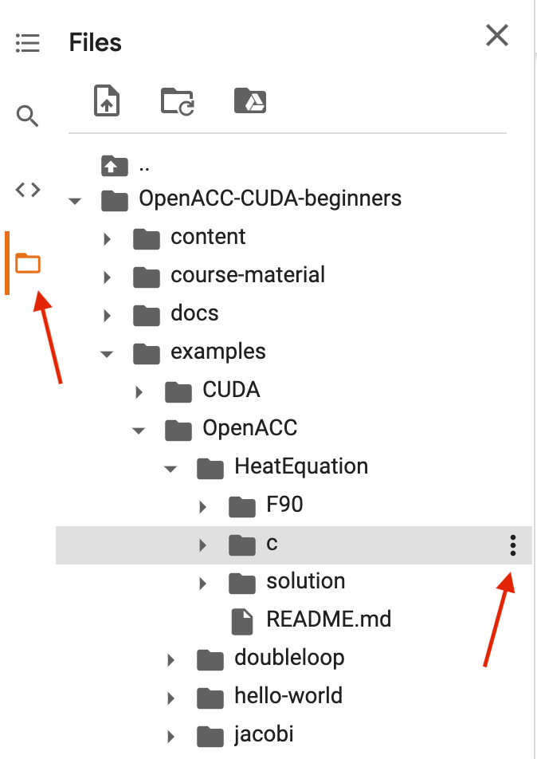

.. _setup:

Setup
=====

In order to follow type-along sessions and do exercises in this lesson
you will need access to a computational resource with GPUs and
installations of CUDA and compilers supporting OpenACC.

.. callout:: Where to run the exercises

   During an ENCCS workshop the primary way to do the exercises is to use
   the cluster available to workshop participants. You can find instruction
   for the Tetralith cluster below.

   If you do not have access to Tetralith but you have a user account on another
   GPU cluster you can use that instead - note however that you will need to
   adapt the instructions below according to the specifics of that cluster.

   If you do not have access to any GPU cluster, you can follow the instructions
   below on how to use Google Colab.

   
.. callout:: Download example codes

  The C and Fortran codes used for exercises in this lesson are contained
  in the same Git repository as the lesson material, so it is easiest to clone
  the repository by::

    # if you have set up ssh keys on GitHub:
    git clone git@github.com:ENCCS/OpenACC-CUDA-beginners.git
    # otherwise:
    git clone https://github.com/ENCCS/OpenACC-CUDA-beginners.git

  After that, navigate to the examples directory::

    cd OpenACC-CUDA-beginners/examples

  OpenACC examples are contained in the ``OpenACC`` directory and CUDA examples
  are in the ``CUDA`` directory.

  Code examples on the main branch use PGI compilers, which are available on e.g.
  the Tetralith cluster where the Nvidia HPC-SDK is installed. If you are on another
  cluster which doesn't have PGI compilers, or you are using Google Colab, you should
  instead use the GNU version of the examples by changing to the ``colab_gcc`` branch::

    git checkout colab_gcc

Running on Tetralith
--------------------

How to log in
^^^^^^^^^^^^^

On any Linux or Mac OS system, you can log in to Tetralith using the following
command in a terminal::

  ssh  <username>@tetralith.nsc.liu.se

On Windows systems, you need to install
`PuTTY <https://www.chiark.greenend.org.uk/~sgtatham/putty/>`__ to log in
to Tetralith. More details can be found at
https://www.nsc.liu.se/support/systems/tetralith-getting-started

Where to run jobs
^^^^^^^^^^^^^^^^^

When you log in on the Tetralith system, you can read the welcome messages (motd) ::

 Welcome to NSC and Tetralith!

 **** Project storage directories available to you:
 /proj/snic2021-22-274/users/x_username

 **** Documentation and getting help:
 https://www.nsc.liu.se/support/systems/tetralith-getting-started/
 https://www.nsc.liu.se/support

 **** Useful commands
 To see your active projects and CPU time usage: projinfo
 To see available disk storage and usage: snicquota
 To see your last jobs: lastjobs
 Login to compute node to check running job: jobsh

 To tweak job priorities, extend timelimits and reserve nodes: see
 https://www.nsc.liu.se/support/batch-jobs/boost-tools/

In this workshop, we recommend that you use your project folder,
i.e. **/proj/snic2021-22-274/users/<your_username>**, to do the exercises:: 

 cd /proj/snic2021-22-274/users/<your_username>

In your project directory, download the exercises by cloning the lesson
repository::

  git clone https://github.com/ENCCS/OpenACC-CUDA-beginners.git
  cd OpenACC-CUDA-beginners

Module system
^^^^^^^^^^^^^

As on other HPC centers, modules are used to maintain and use large
set of programs on Tetralith at NSC. The main module commands are
presented below. ::

 module --help         General help with module commands
 
 module avail          List the available modules and recommendations
 
 module load ...       Load the selected modules into your session (can also write: module add)
 
 module list           List your currently loaded modules (will be flushed at logout)

 module rm ...         Remove selected modules from your session

 module purge          Remove all loaded modules

 module use ...        Use the modulefile which is not installed in default path

More information about module system at NSC can be found at
https://www.nsc.liu.se/software/modules

Build scripts for many of the exercises in this lesson rely on the
`NVIDIA HPC SDK <https://developer.nvidia.com/hpc-sdk>`__. To load
this environment, type::

  # Load the nvhpc module for using pgcc/pgf90 compiler
  module use /proj/snic2021-22-274/hpc_sdk/modulefiles
  module add nvhpc

How to edit files
^^^^^^^^^^^^^^^^^

If you are used to emacs or vim, you can use these on Tetralith. If you're not
used to these text editors, a good choice is to use the nano editor. Type
``nano <filename>`` to open a file. You can edit it as you want, save it by pressing
``CTRL-o`` and exit by ``CTRL-x``.
  
How to submit jobs
^^^^^^^^^^^^^^^^^^

NSC uses the Slurm workload manager for job
scheduling. You can either run program interactively:

  .. code-block::
         
     # book a GPU compute node for 1 hour
     # using project ID "snic2021-22-274" for the workshop
     # and reservation "openacc-cuda-workshop-2021-05-04" for first day
     interactive -n 1 -c 32 --gpus-per-task=1 -t 60 -A snic2021-22-274 --reservation=openacc-cuda-workshop-2021-05-04
     ...
     
or in batch mode with a job script::

     sbatch job.sh

where the job script *job.sh* specifies the project ID, wall-clock time, number of node etc:

.. code-block:: bash
     
   #!/bin/bash
   #SBATCH --account=snic2021-22-274
   #SBATCH --ntasks=1
   #SBATCH --gpus-per-task=1
   #SBATCH --time=00:15:00

   module use /proj/snic2021-22-274/hpc_sdk/modulefiles
   module load nvhpc

   srun ./sum

  
Summary 
^^^^^^^

Here is a sample process to run OpenACC program on Tetralith:

.. code-block:: bash

  # login on Tetralith from local computer
  local_computer $ ssh <your_username>@tetralith.nsc.liu.se
  ...
  # use /proj/snic2021-22-274 folder
  tetralith $ cd /proj/snic2021-22-274/users/<your_username>

  # git the course material
  tetralith $ git clone https://github.com/ENCCS/OpenACC-CUDA-beginners.git

  # Use the example c code for vector addition
  tetralith $ cd OpenACC-CUDA-beginners/examples/OpenACC/vector-sum/c

  # Load the nvhpc module for using pgcc/pgf90 compiler
  tetralith $ module use /proj/snic2021-22-274/hpc_sdk/modulefiles
  tetralith $ module avail nvhpc

  # compile the code (or direct use "make")
  tetralith $ ./compile.sh

  # check if the binary created
  tetralith $ ls
   Makefile  compile.sh  job.sh  sum  sum.c

  # run the binary "sum" on GPU, 
  tetralith $ sbatch job.sh
  tetralith $ cat slurm-<job_id>.out
    Reduction sum: 1.2020569031119108

  # or directly use "srun ... ./sum",
  tetralith $ srun -n 1  --gpus-per-task=1 -t 10 -A snic2021-22-274 --reservation=openacc-cuda-workshop-2021-05-04 ./sum
  Reduction sum: 1.2020569031119108

  # or run interactive
  tetralith $ interactive -n 1 -c 32 --gpus-per-task=1 -t 60 -A snic2021-22-274 --reservation=openacc-cuda-workshop-2021-05-04
  salloc: job 13170656 has been allocated resources
  salloc: Granted job allocation 13170656
  srun: Step created for job 13170656
  
  # Note: compute node has been assigned, check using command "hostname"
  # should directly run the binary
  n1141 $ ./sum
   Reduction sum: 1.2020569031119108
     

Running on Google Colab
-----------------------

If you do not have access to any HPC clusters with GPUs, a fallback option
can be to use the `Google Colab service <https://colab.research.google.com/>`__
where you can get access to GPUs in the cloud through Jupyter notebooks.
**Note: This requires that you have a Google account.**

- First click the "Open in Colab" button on https://colab.research.google.com/github/ENCCS/OpenACC-CUDA-beginners/blob/colab_gcc/examples/openACC_CUDA_colab.ipynb and enter your Google login information.
- A Google-flavored Jupyter notebook should open on Colab which contains commands to get up and
  running on Colab. You need to press ``SHIFT-ENTER`` on the cells to execute them.
- To get access to a GPU, click on the *Runtime* menu and select *Change runtime type*.
  Choose GPU as a Hardware accelerator. It might take a minute for your notebook to
  connect to a GPU.
- To check whether a GPU has been connected to your session, run the code cell with the ``!nvidia-smi``
  command by hitting ``SHIFT-ENTER`` on it.
- Click through the next few cells to clone the material, change to the colab branch and enter the
  exercise directories.

All work on Google Colab needs to be done through a Jupyter notebook.
Here is how you can work on the exercises:

- New code or text (markdown) cells can be created by clicking the "+Code" and "+Text" buttons,
  or through the keyboard shortcut ``CTRL-m b``. Cells can be deleted by ``CTRL-m d``.
  Cells are executed by pressing ``SHIFT-ENTER`` or pressing the Play button. Pressing instead
  ``ALT-ENTER`` runs a cell and creates a new one underneath, while ``CTRL-ENTER`` runs the cell
  and stays on the same cell.
- General shell commands can be entered into a code cell by prepending it with
  exclamation mark (e.g. ``!ls``). Some shell commands have corresponding "magic" commands (e.g. "%ls"),
  and some commands need to use the magic form. In particular, to change directory you need ``%cd some/path``.
- Explore the directory structure by clicking on the *Files* symbol in the left-hand
  panel and navigate the *OpenACC-CUDA-beginners / examples* directory (see red arrow in image below).
- In the file browser, navigate to the subfolder of the exercise you wish to work on and
  click on the three dots next to the directory and select "Copy path" (see red arrow in image below).
- In a code cell, paste the path into a ``%cd`` magic command to change directory.
- After changing directory, you can for example compile code with Makefiles by ``!make``. 
- You can open a text editor by double-clicking a file. This opens an editor on the right of the
  notebook and you can edit it there and save by hitting ``CTRL-s`` or going through the *File* menu.
  **Note**: it is for some reason impossible to open files with ``.cu`` ending in the Colab editor,
  so open instead the symbolic links with ``.cpp`` ending when working on these files. 
  

